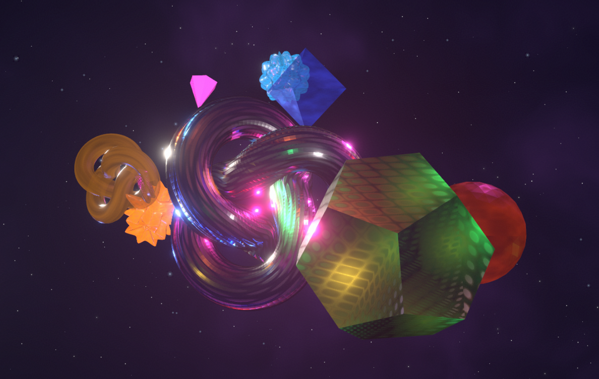

# Observatory

Interactive 3D scene — glowing glass figures drift through a nebula. Three are
portfolio projects: click one to fly the camera in. An *Objects* slider summons a
collision-free field of extra shapes, from polyhedra to parametric math surfaces.

**Live → [marvinbaudach.github.io/observatory](https://marvinbaudach.github.io/observatory/)**



## Tech

- React Three Fiber 9 · Three.js 0.184 · drei 10 · postprocessing (Bloom)
- Next.js 16 (App Router, static export) · React 19 · TypeScript 6
- GitHub Pages via Actions

## Highlights

- Cut-glass crystals: `meshPhysicalMaterial` transmission + dispersion, double-sided
- Parametric math surfaces (spherical harmonic, Gielis supershape, Klein bottle)
- Camera fly-to via `CameraControls.setLookAt()`; ACES Filmic tonemapping
- Adaptive DPR via `PerformanceMonitor` with a lighter mobile path
- Object count persisted in `localStorage`

## Develop

```bash
npm install
npm run dev                      # localhost:3000
GITHUB_PAGES=true npm run build  # static export → out/
```
